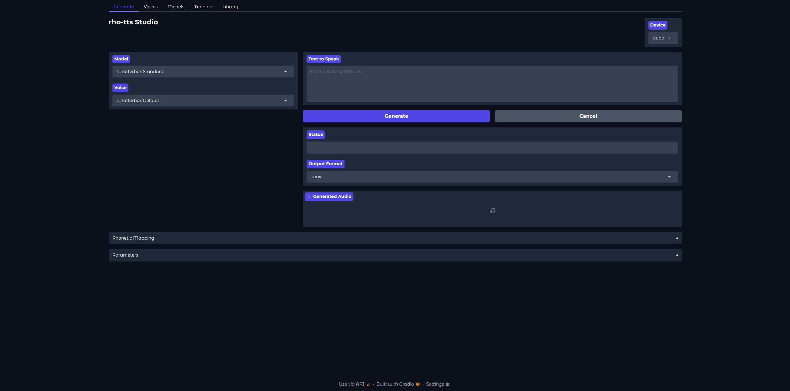
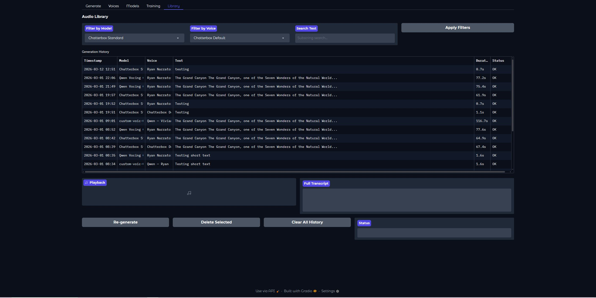
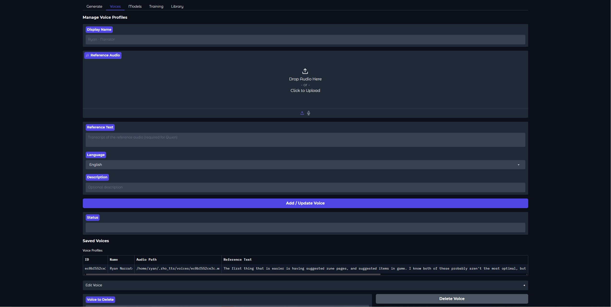
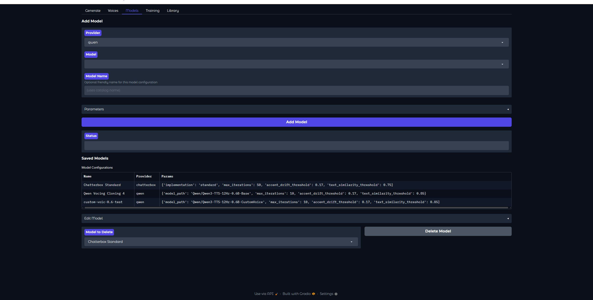
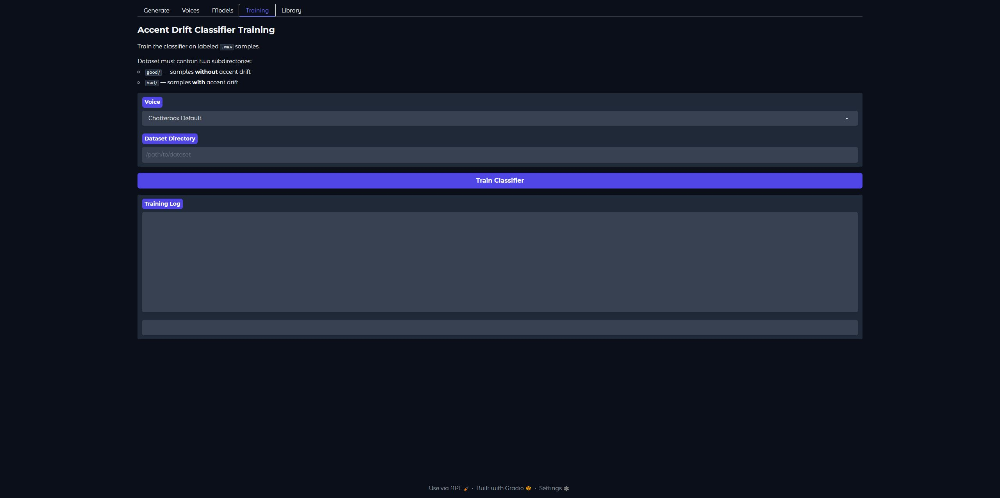

# rho-tts

Multi-provider text-to-speech library with voice cloning, accent drift detection, and STT validation.

## Features

- **Multi-provider TTS** — Swap between Qwen3-TTS, Chatterbox, and Breeze-TTS-2 with a single parameter
- **Voice cloning** — Clone any voice from a short reference audio sample
- **Accent drift detection** — ML classifier catches when the generated voice drifts from your target accent
- **STT validation** — Whisper-based transcription check ensures the model actually said what you asked it to
- **Speaker similarity** — Cosine similarity scoring between generated and reference voice embeddings
- **Audio post-processing** — Silence trimming, crossfading, DC offset removal, fade-in/out
- **Batch processing** — Generate multiple audio files efficiently with memory management
- **Cooperative cancellation** — Thread-safe cancellation tokens for long-running generation tasks
- **Extensible** — Register custom TTS providers via `TTSFactory.register_provider()`

## Installation

```bash
# Core only (brings torch, torchaudio, numpy, pydub)
pip install rho-tts

# With Qwen3-TTS provider
pip install rho-tts[qwen]

# With Chatterbox provider
pip install rho-tts[chatterbox]

# With Breeze-TTS-2 provider (always runs in its own isolated venv)
pip install rho-tts[breeze]

# With validation (accent drift, STT, speaker similarity)
pip install rho-tts[validation]

# Everything except Breeze
pip install rho-tts[all]
```

> **Breeze is excluded from `[all]` on purpose.** It pins `torch==2.9.1` and
> `transformers==4.57.3`, which conflict with the other providers, so it is
> always run through the subprocess isolation layer in its own venv (created
> automatically under `~/.rho_tts/venvs/breeze/`). Its model weights are also
> under the BreezeBlue Research and Non-Commercial License — commercial use
> requires written authorization from RESONIA, INC. The upstream code itself is
> Apache 2.0.

### System Dependencies

- **ffmpeg** — Required by pydub for audio file joining
- **CUDA** — GPU recommended for reasonable generation speed (CPU works but is slow)

```bash
# Ubuntu/Debian
sudo apt install ffmpeg

# macOS
brew install ffmpeg
```

### Hardware Requirements

| Model | VRAM | Notes |
|-------|------|-------|
| Qwen3-TTS 0.6B | ~8 GB | Smaller, faster |
| Qwen3-TTS 1.7B | ~16 GB | Higher quality |
| Chatterbox | ~6 GB | Good for single segments |
| Breeze-TTS-2 | ~12 GB | Instruction-driven voice design; 24 kHz output |
| Validation (Whisper) | ~1 GB | Runs on CPU by default |

## Quick Start

```python
from rho_tts import TTSFactory

# Create a TTS instance (requires a reference audio for voice cloning)
tts = TTSFactory.get_tts_instance(
    provider="qwen",
    reference_audio="my_voice.wav",
    reference_text="Transcript of my voice sample.",
)

# Generate a single file
result = tts.generate("Hello world!", "output.wav")

# Generate without saving to disk (in-memory only)
result = tts.generate("Hello world!")
print(result.audio, result.duration_sec)

# Generate a batch
results = tts.generate(
    texts=["First sentence.", "Second sentence."],
    output_path="batch_output",
)
```

## Providers

### Qwen3-TTS (default)

Best for batch generation with validation. Supports voice cloning via reference audio + text.

```python
tts = TTSFactory.get_tts_instance(
    provider="qwen",
    reference_audio="voice.wav",
    reference_text="What the voice says in the audio file.",
    model_path="Qwen/Qwen3-TTS-12Hz-1.7B-Base",  # or local path
    batch_size=5,
    max_iterations=10,
    accent_drift_threshold=0.17,
    text_similarity_threshold=0.85,
)
```

### Chatterbox

Best for single-segment regeneration with comprehensive validation loops.

```python
tts = TTSFactory.get_tts_instance(
    provider="chatterbox",
    reference_audio="voice.wav",
    implementation="faster",  # rsxdalv optimizations
    max_iterations=50,
    accent_drift_threshold=0.17,
    text_similarity_threshold=0.75,
    speaker_similarity_threshold=0.85,
)
```

### Breeze-TTS-2

The only provider that accepts natural-language voice *direction*. Cloning
requires the reference audio **and its exact transcript**; without a reference
it designs a voice from the instruction alone.

```python
tts = TTSFactory.get_tts_instance(
    provider="breeze",
    reference_audio="voice.wav",
    reference_text="The exact words spoken in voice.wav.",
    instruction="Speak warmly, with a slow, measured pace.",
    cfg_scale=4.0,  # 1.0 disables instruction steering
)
```

The first call provisions the isolated venv and downloads the pinned model
revision, so expect a long startup; subsequent runs reuse both.

## Configuration

All thresholds and parameters can be set via constructor kwargs:

| Parameter | Default | Description |
|-----------|---------|-------------|
| `device` | `"cuda"` | `"cuda"` or `"cpu"` |
| `seed` | `789` | Random seed for reproducibility |
| `deterministic` | `False` | Deterministic CUDA ops (slower) |
| `phonetic_mapping` | `{}` | Word-to-pronunciation overrides |
| `max_iterations` | `10`/`50` | Max validation retry loops |
| `accent_drift_threshold` | `0.17` | Max accent drift probability |
| `text_similarity_threshold` | `0.85`/`0.75` | Min STT text match score |
| `sound_decay_threshold` | `0.3` | Max RMS decay ratio (final vs first third) |
| `max_decay_retries` | `3` | Full-regeneration attempts on sound decay |
| `batch_size` | `5` | Texts per batch (Qwen only) |

## Custom Providers

Register your own TTS implementation:

```python
from rho_tts import BaseTTS, TTSFactory

class MyTTS(BaseTTS):
    def _generate_audio(self, text, **kwargs):
        # Your model inference here — return a torch.Tensor
        ...

    @property
    def sample_rate(self):
        return 24000

TTSFactory.register_provider("my_tts", MyTTS)
tts = TTSFactory.get_tts_instance(provider="my_tts")
```

## Validation Pipeline

When validation deps are installed (`pip install rho-tts[validation]`), generated audio goes through:

1. **Accent drift detection** — A trained classifier predicts the probability that the voice has drifted from the target accent. Samples exceeding the threshold are regenerated.

2. **STT text matching** — Whisper transcribes the audio and compares it against the intended text using fuzzy matching with number normalization. The normalizer handles word numbers, ordinals, dates, currency, and times (e.g. `"five dollars and ninety nine cents"` → `"$5.99"`, `"march twenty second"` → `"march 22"`) via NeMo inverse text normalization.

3. **Speaker similarity** — Cosine similarity between the generated audio's speaker embedding and the reference voice embedding.

### Training the Accent Drift Classifier

Prepare a dataset with `good/` and `bad/` subdirectories containing `.wav` files, then train a classifier. Models can be trained globally or per-voice.

#### Per-voice models (recommended)

Each voice can have its own classifier, stored at `~/.rho_tts/models/{voice_id}_classifier.pkl`. This gives better accuracy since accent drift patterns differ between voices.

```bash
# CLI
python -m rho_tts.validation.classifier.trainer \
    --dataset-dir /path/to/dataset \
    --voice-id my_voice
```

```python
# Library
from rho_tts.validation.classifier.trainer import train

train(dataset_dir="/path/to/dataset", voice_id="my_voice")
```

During generation, set `voice_id` on the TTS instance to use the per-voice model automatically:

```python
tts = TTSFactory.get_tts_instance(provider="qwen", reference_audio="voice.wav", reference_text="...")
tts.voice_id = "my_voice"
tts.generate(texts, "output")  # uses ~/.rho_tts/models/my_voice_classifier.pkl
```

#### Global model

A global model is used as a fallback when no per-voice model exists.

```bash
# Train a global model
python -m rho_tts.validation.classifier.trainer --dataset-dir /path/to/dataset

# Or specify an explicit output path
python -m rho_tts.validation.classifier.trainer \
    --dataset-dir /path/to/dataset \
    --output /path/to/voice_quality_model.pkl
```

#### Auto-sorting samples

During generation, samples can be automatically sorted into `good/` and `bad/` folders based on their drift score — building your training dataset as you generate.

```python
tts = TTSFactory.get_tts_instance(provider="qwen", reference_audio="voice.wav", reference_text="...")
tts.voice_id = "my_voice"

# Set the target directories
tts.auto_sort_good_dir = "/path/to/dataset/good"
tts.auto_sort_bad_dir = "/path/to/dataset/bad"

# Set the thresholds (drift probability 0-1)
tts.auto_sort_good_threshold = 0.10  # below this → good/
tts.auto_sort_bad_threshold = 0.25   # above this → bad/

# Samples between 0.10 and 0.25 are ambiguous and skipped
tts.generate(texts, "output")
```

| Attribute | Description |
|-----------|-------------|
| `auto_sort_good_dir` | Directory to copy low-drift samples to |
| `auto_sort_bad_dir` | Directory to copy high-drift samples to |
| `auto_sort_good_threshold` | Drift prob below this → `good/` |
| `auto_sort_bad_threshold` | Drift prob above this → `bad/` |

The sorted files use the same `good/` / `bad/` structure the trainer expects, so you can point the trainer directly at the parent directory.

#### Model lookup order

When predicting accent drift, the classifier checks for models in this order:

1. Per-voice model at `~/.rho_tts/models/{voice_id}_classifier.pkl`
2. Explicit path passed via `model_path` parameter
3. `RHO_TTS_CLASSIFIER_MODEL` environment variable
4. Bundled global model

```bash
# Override the global model path via environment variable
export RHO_TTS_CLASSIFIER_MODEL=/path/to/voice_quality_model.pkl
```

## Web UI

A Gradio-based web interface for interactive TTS generation, voice management, and model configuration.

### Installation

```bash
# From PyPI
pip install rho-tts[ui]

# From local source
pip install -e ".[ui]"
```

### Launch

```bash
# CLI entry point
rho-tts-ui

# Or as a Python module
python -m rho_tts.ui

# With options
rho-tts-ui --host 0.0.0.0 --port 8080 --device cpu --share
```

| Flag | Default | Description |
|------|---------|-------------|
| `--config` | `~/.rho_tts/config.json` | Path to config JSON file |
| `--host` | `127.0.0.1` | Server bind address |
| `--port` | `7860` | Server port |
| `--device` | `cuda` | `cuda` or `cpu` |
| `--share` | off | Create a public Gradio link |

The config path can also be set via the `RHO_TTS_CONFIG` environment variable.

### Tabs











- **Generate** — Select a model and voice, enter text, and generate audio with real-time playback. Includes phonetic mapping overrides per voice/model pair.
- **Voices** — Upload reference audio and transcripts to create reusable voice profiles (stored in `~/.rho_tts/voices/`).
- **Models** — Configure TTS providers with custom thresholds and parameters.

## Cancellation

For long-running generation in web servers or UIs:

```python
from rho_tts import CancellationToken, TTSFactory

token = CancellationToken()

# In worker thread
tts = TTSFactory.get_tts_instance(provider="qwen", reference_audio="voice.wav", reference_text="...")
result = tts.generate(texts, "output", cancellation_token=token)

# In controller thread (e.g., on user cancel button)
token.cancel()
```

## License

MIT

### Consistent narration across segments

Install `rho-tts[validation]` to enable optional speaker and speech-level checks.
Breeze's isolated environment already includes these dependencies.

```python
from rho_tts import ContinuityConfig, TTSFactory

tts = TTSFactory.get_tts_instance(provider="breeze", max_iterations=3)
first = tts.generate("First passage.", "first.wav", continuity=ContinuityConfig())
second = tts.generate(
    "Next passage.", "second.wav",
    continuity=ContinuityConfig(previous_audio=first.path),
)
if second is not None and not second.continuity["passed"]:
    print("Closest available voice selected; review the audio", second.continuity)
```

`continuity` is explicit per-call context, supported by `generate` and
`async_generate`, including isolated providers. Without it, continuity validation
is disabled. With it, internal text segments and successive list items form one
sequence; start another call without `previous_audio` to start a new sequence.
The provider never remembers a predecessor across calls. Streaming does not yet
accept continuity context.

Speaker cosine similarity defaults to at least 0.75, and active-speech RMS level
may differ by at most 6 dB. Quiet frames are excluded so trailing silence does not
lower the measured level. These are initial heuristics, not calibrated perceptual
guarantees. Measurements apply to synthesized segments before joining,
post-processing, and speed/pitch transforms, not to final mastered audio.
An adjacent comparison also cannot rule out gradual drift over a long sequence.

Continuity, accent, and text checks share `max_iterations` per segment, within
each existing sound-decay retry pass. Retries advance the seed inside the actual
provider, including when isolated. Candidates passing accent/text checks are
preferred, then ranked by normalized continuity deficit and accent drift.
After exhaustion, `allow_fallback=True` returns the best available candidate.
Set `ContinuityConfig(allow_fallback=False)` to reject exhaustion;
`strict_validation=True` on the provider always rejects it. Missing validators,
invalid features, unreadable references, or undetectable speech raise
`ValidationError` even when fallback is enabled.

`GenerationResult.continuity` contains `passed` and a `segments` list. Each segment
records its numbered attempts, measurements, existing-validator verdicts,
`selected_attempt`, `passed` (continuity only), and `fallback` (any validation
failed). `text_passed` is `None` when an accent failure skips text validation;
the selected candidate has no text similarity score if its check was skipped.
Cancellation retains the existing `None` return convention. Applications own
sequence ordering, cache invalidation, persistence of evidence, and warning UI.
